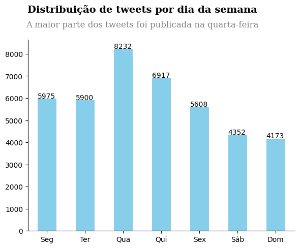
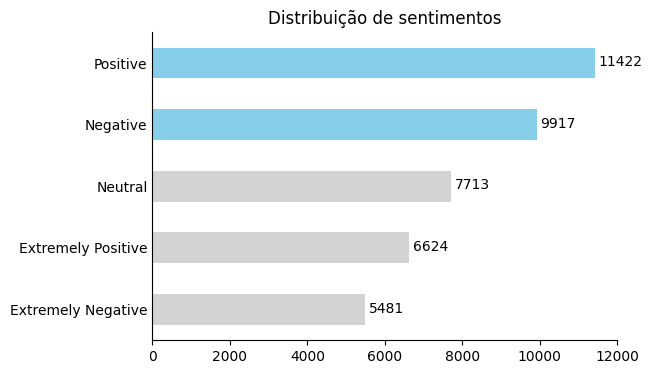
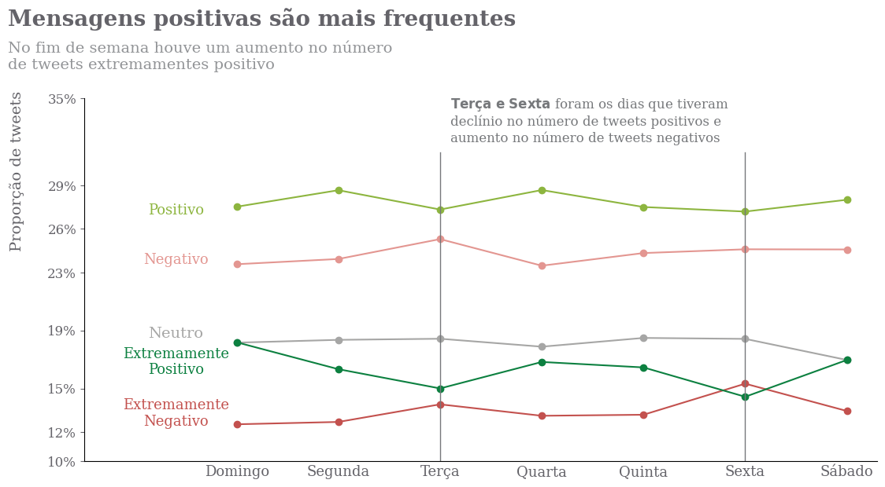
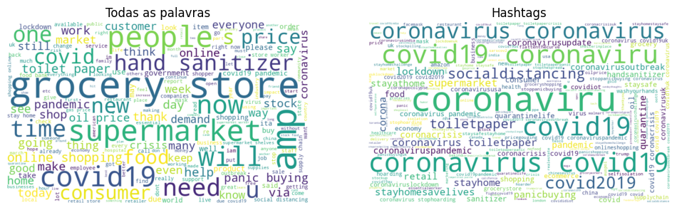

<div align="center">
<h1 style="color:#1597e8">
    Análise de Sentimentos em Tweets 🐦<br/>
    <span style="font-size:18px; color:gray">Coletados durante a pandemia da COVID-19 🦠</span>
</h1>
</div>
<div align="center">
<!-- python -->

<!-- pré-commit -->

<br/>
<!-- pandas -->

<!-- matplotlib -->

<!-- sklearn -->

<!-- spacy -->

<!-- poetry -->


<p>Projeto de análise de sentimentos em tweets utilizando técnicas de NLP e Machine Learning.</p>
<figure align="center">

<br/>
<figcaption>Imagem de <a href="https://www.freepik.com/free-vector/messenger-concept-illustration_6199003.htm#fromView=search&page=1&position=20&uuid=5d4efd58-f6fd-4d35-8037-4edfc7d04b91">storyset</a> no <a href="https://www.freepik.com/">Freepik</a></figcaption>
<figure>
</div>

## 📚 Sobre o Projeto

A pandemia de COVID-19 trouxe consigo uma série de mudanças na vida das pessoas, desde a forma de trabalhar até a forma de se comunicar. Com o isolamento social, as redes sociais se tornaram um dos principais meios de comunicação entre as pessoas, e com isso, a quantidade de informações e opiniões compartilhadas aumentou consideravelmente.

A análise de sentimentos em textos é uma assunto dentro da área Processamento de Linguagem Natural (NLP) que tem como objetivo identificar e extrair informações sobre as emoções e opiniões expressas em textos. Neste projeto, realizamos a análise dos tweets e a classificação dos sentimentos expressos neles, utilizando técnicas de NLP e aprendizado de máquina.

## 📦 Conteúdo

- [Sobre o Projeto](#-sobre-o-projeto)
- [Conteúdo](#-conteúdo)
- [Objetivos](#-objetivos)
- [Dados](#-dados)
- [Tecnologias Utilizadas](#-tecnologias-utilizadas)
- [Como Executar o Projeto](#-como-executar-o-projeto)
- [Licença](#-licença)

## 🎯 Objetivos
### Objetivo Geral
Explorar e analisar os dados do conjunto de *tweets* coletados sobre a COVID-19, buscando identificar padrões e *insights* relevantes sobre a percepção da população durante a pandemia.

### Objetivos Específicos:
1. **Análise Exploratória de Dados:**
    - Descrever as características estatísticas do conjunto de dados, como distribuição de frequências dos sentimentos, localização dos usuários e datas dos *tweets*.
    - Visualizar os dados por meio de gráficos e tabelas para compreender distribuição dos sentimentos.
2. **Pré-processamento de Texto:**
    - Aplicar técnicas de pré-processamento como remoção de stopwords, lematização e normalização para minúsculas para a análise.
    - Avaliar o impacto do pré-processamento na performance dos modelos de classificação de sentimentos.
3. **Extração de Características:**
    - Testar diferentes técnicas de vetorização, como *Bag of Words* (BOW), TF-IDF, *Word Embeddings* e *Sentence Embeddings*, para identificar a melhor representação do texto para a tarefa.
    - Comparar o desempenho dos modelos de classificação com as diferentes técnicas de vetorização, usando métricas de avaliação como acurácia, precisão, cobertura e *F1-score*.
4. **Classificação de Sentimentos:**
   - Treinar e avaliar diferentes modelos de classificação de sentimentos, como Máquina de Vetores de Suporte (SVM), Regressão Logística e Floresta Aleatória, para identificar o modelo com melhor desempenho. Usamos também o modelo [Mixtral-8x7B-Instruct-v0.1](https://huggingface.co/mistralai/Mixtral-8x7B-Instruct-v0.1) para classificação de sentimentos.
5. **Análise de Resultados:**
   - Interpretar os resultados da classificação de sentimentos e identificar os principais tópicos e sentimentos presentes nos *tweets*.

## 🎲 Dados

Para esse estudo, usamos os dados coletados do Twitter, disponível no [Kaggle](https://www.kaggle.com/datatattle/covid-19-nlp-text-classification). Foi utilizado conjunto de treino, composto por 41.557 *tweets*, foi coletado entre os dias 16 de março e 14 de abril de 2020. As 6 colunas presentes nele são:

1. `OriginalTweet`: O texto original do *tweet*, contendo a mensagem relacionada à pandemia de COVID-19. Esse campo é o principal objeto de análise do projeto.
2. `Sentiment`: O sentimento predominante no *tweet*, categorizado em 5 classes:
   - **Extremamente Negativo**
    - **Negativo**
    - **Neutro**
    - **Positivo**
    - **Extremamente Positivo**

3. `TweetAt`: A data em que o *tweet* foi publicado, permitindo a análise temporal dos dados.
4. `Location`: A localização cadastrada pelo usuário que publicou o *tweet*.
5. `ScreenName`: O nome de usuário do *Twitter* codificado, protegendo a identidade dos autores dos tweets.
6. `UserName`: A arroba (@) do usuário do *Twitter* codificada, complementando a informação do `ScreenName`.

Analisando por dia da semana, na Figura 1, vemos que a quarta-feira foi o dia com mais *tweets*, seguido pela quinta-feira. Já o domingo foi o dia com menos *tweets*.

<div align="center">

<br/>
<small>Figura 1: Distribuição de tweets por dia da semana</small>
</div>


Quanto à distribuição dos sentimentos, a Figura 2 mostra que a maioria dos *tweets* está rotulada como **Positive**, seguido por **Negative** e **Neutral**. Os sentimentos **Extremamente Negativo** e **Extremamente Positivo** são minoria no conjunto de dados.

<div align="center">

<br/>
<small>Figura 2: Distribuição de tweets por sentimento</small>
</div>

Ainda no tema de *tweets* por dia da semana, a Figura 3 mostra a variação de quantidade de *tweets* por sentimento. Vemos que o sentimento **Positivo** é o mais frequente em todos os dias da semana, seguido por **Negativo** .  

<div align="center">

<br/>
<small>Figura 3: Distribuição de sentimentos por dia da semana</small>
</div>

Para entender melhor o conteúdo dos *tweets*, selecionamos 5 exemplos de *tweets* para cada sentimento:

a) **Extremamente Negativo**:
```
Matters have gotten desperate in Not a single shop grocery provision store has been allowed to open for 3 days inspite of assurances by If we step out looking for bread we are beaten by cops Starvation will kill is before
```

b) **Negativo**:
```
Just because the sun is shining doesn't mean it's going to save you, your neighbours nor your family and friends from covid-19. I have to work at a supermarket so people can still get food. Just stay the fuck inside or have you not heard that nearly 5000 Britons have died?
```

c) **Neutro**:
```
Here we go. Today the #Coronavirus has arrived in the next county over, and my regular grocery store is starting to get cleaned out.
```

d) **Positivo**
```
Stay home this is a #pandemic #churches need to do the services online do your grocery shopping online  and tip well I will be doing the same if you do go out wear a mask #stayhome #coronavirus #covid19 #CoronavirusPandemic
```

e) **Extremamente Positivo**
```
The Berkshire Dream Center in is working to help families in need stock up and stay prepared with basic necessities amid the outbreak Food diaper distribution is taking place today on Tyler Street Details here
```

A análise das amostras revelou que os textos dos *tweets* analisados compartilham um tema comum, centrado nas **dificuldades associadas às compras**. Para validar esta suposição, procedemos à extração e contagem da frequência das palavras e *hashtags* presentes nos textos. A Figura 4 ilustra uma nuvem de palavras, onde o tamanho de cada palavra reflete a sua frequência de ocorrência. Observamos que as palavras que mais se destacam são "grocery", "store", "supermarket" e "covid19". Quanto às *hashtags*, as mais comuns são "#coronaviru", "#covid19", "#coronavirus" e suas variações. Esses resultados indicam uma preocupação significante dos usuários com esse tema.

<div align="center">

<br/>
<small>Figura 4: Nuvem de palavras com as palavras mais frequentes nos *tweets*</small>
</div>

## 🛠️ Tecnologias Utilizadas

- [Python](https://www.python.org/)
- [Pandas](https://pandas.pydata.org/)
- [Matplotlib](https://matplotlib.org/)
- [Scikit-Learn](https://scikit-learn.org/stable/)
- [Spacy](https://spacy.io/)
- E outras bibliotecas de Python


## 🚀 Como Executar o Projeto

### Pré-requisitos

Antes de começar, você vai precisar ter instalado em sua máquina as seguintes ferramentas:
- [Git](https://git-scm.com/)
- [Python](https://www.python.org/)
- [Pip](https://pypi.org/project/pip/)

Além disto é bom ter um editor para trabalhar com o código como [VSCode](https://code.visualstudio.com/)

### 🧭 Rodando o Jupyter Notebook

```bash
# Clone este repositório
$ git clone https://github.com/jessicacardoso/sentiment-analysis-tweets.git
```
```bash
# Acesse a pasta do projeto no terminal/cmd
$ cd sentiment-analysis-tweets
```
```bash
# Instale as dependências
$ pip install -r requirements.txt
```
```bash
# Execute o Jupyter Notebook
$ jupyter notebook
```

## 📝 Licença

Este projeto esta sobe a licença [MIT](./LICENSE).
