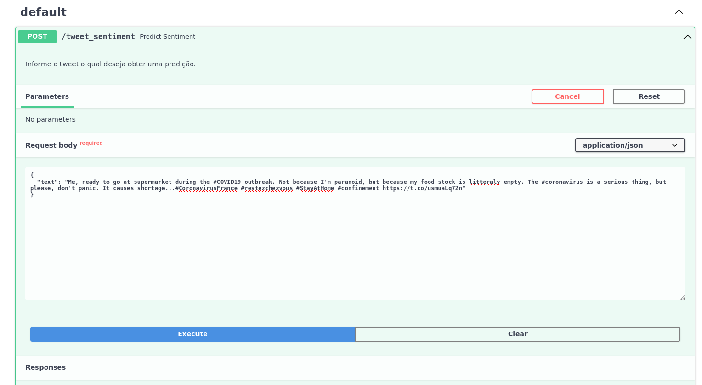

# Análise de Tweets de Covid



Nesse repositório, exploramos um conjunto de *tweets*  coletados durante a pandemia da Covid-19, realizamos análises que  visavam identificar quais termos foram mais comentados no período da  coleta desses dados. Além disso, realizamos a tarefa de predição do sentimento  contido nos *tweets* propostos. Uma API de predição também se encontra nesse repositório.

O *dataset* utilizado nesse repositório pode ser baixado no [kaggle](https://www.kaggle.com/datatattle/covid-19-nlp-text-classification).

## :zap: **Tecnologias**

<h1 align="center">
  
  <br>
</h1>


- Pandas
- Numpy
- Seaborn
- Matplotlib
- Tensorflow
- Scikit-learn

dentre outras ...


## :hammer_and_wrench:Como executar o projeto

Essa aplicação foi desenvolvida no sistema operacional Ubuntu 20.04.3 LTS com a versão do python 3.7 do Miniconda.

Primeiro realize a preparação do ambiente:

```bash
# 1. Crie um ambiente virtual  
conda create -n my_env python=3.7

# 2. Ative o ambiente de desenvolvimento
conda activate my_env

# 3. Instale as dependências do projeto
pip install -r requirements.txt
```


### API

```bash
# Execute a aplicação em modo de desenvolvimento
uvicorn main:app --reload

# O servidor iniciará na porta:8000 - disponível http://localhost:8000
```

Para ter acesso a documentaçao gerada pelo Swagger, acesse o caminho http://localhost:8000/docs


#### Jupyter Notebook

```bash
# Inicie o jupyter
jupyter notebook

# O servidor iniciará na porta:8888 - disponível em http://localhost:8888/tree
```
